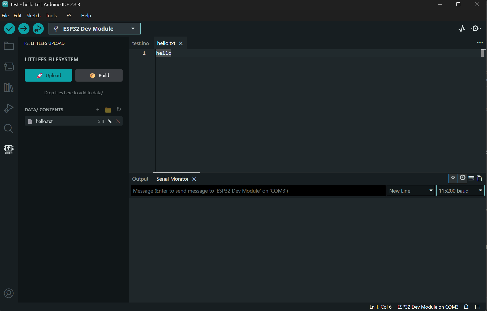

# Arduino LittleFS Upload

A sidebar plugin for **Arduino IDE 2.x** that builds and uploads LittleFS filesystem images to ESP32, ESP8266, and RP2040 boards.

Fork of [earlephilhower/arduino-littlefs-upload](https://github.com/earlephilhower/arduino-littlefs-upload) — rebuilt with a sidebar UI, file manager, and smart serial monitor handling.

## Features

- **Sidebar panel** with Upload and Build buttons (no more Command Palette digging)
- **File manager** — view, add, delete, and edit files in your sketch's `data/` folder
- **Drag & drop** — drop files directly onto the sidebar to add them to `data/`
- **Add folders** — copy entire folders into `data/` recursively
- **Auto-rename** — duplicate filenames get `(1)`, `(2)` suffixes automatically
- **Edit in place** — click the pencil icon to open any file in the editor
- **Auto-refresh** — file list updates automatically when `data/` contents change
- **Smart serial monitor** — detects busy COM port, closes Serial Monitor, uploads, then reopens it
- **Supports** ESP32, ESP8266, RP2040 (Pico), and RP2350

## Installation

1. Download the `.vsix` file from [Releases](https://github.com/HamzaYslmn/arduino-littlefs-upload/releases)
2. Copy it to:
   - **Windows:** `C:\Users\<username>\.arduinoIDE\plugins\`
   - **macOS/Linux:** `~/.arduinoIDE/plugins/`
3. Restart Arduino IDE

## Usage

1. Create a `data/` folder inside your sketch directory
2. Put the files you want on the device's filesystem into `data/`
3. **Compile your sketch once** (so the plugin can read board/partition info)
4. Click the **LittleFS** icon in the sidebar (MCU chip icon)
5. Click **Upload** 🚀 to flash the filesystem, or **Build** 📦 to create the image without uploading

### Managing files

- **+** button — add files via file picker
- **📁** button — add an entire folder
- **↻** button — refresh file listing
- **✏** icon — open file in editor
- **✕** icon — delete file
- Drag and drop files directly onto the drop zone

## Supported Boards

| Platform | Boards |
|----------|--------|
| ESP32 | All variants (ESP32, ESP32-S2, S3, C3, C6, H2) |
| ESP8266 | All boards |
| RP2040 | Raspberry Pi Pico, Pico W, and compatible |
| RP2350 | Raspberry Pi Pico 2 and compatible |

## Partition Scheme

The upload target is determined by the partition scheme selected in the Arduino IDE. Make sure your selected scheme includes a SPIFFS or LittleFS data partition (e.g., "Default 4MB with spiffs").

You can also place a custom `partitions.csv` in your sketch folder — the plugin will use it automatically.

## Troubleshooting

### "Could not open port"
The plugin automatically detects this and closes the Serial Monitor for you. If it still fails, manually close the Serial Monitor and retry.

### "Board details not available"
Compile your sketch at least once before uploading. The plugin needs board and tool paths from the build system.

### "mklittlefs not found"
Make sure the board platform package is installed and up to date in the Arduino IDE Board Manager.

### "No data folder found"
Create a `data/` folder inside your sketch directory and add at least one file.

### "FS" appears in the top menu bar
Arduino IDE (Theia) adds a spurious top menu entry for sidebar plugins. To remove it:
1. Press **Ctrl+Shift+P** (or **Cmd+Shift+P** on macOS)
2. Type **Toggle FS Top Bar** and run the command
3. The IDE will reload with the entry removed

On macOS/Linux, you may be prompted for your admin password (one-time). The patch persists until the IDE is updated — just re-run the command after an update.

## Credits

- [Earle F. Philhower, III](https://github.com/earlephilhower) — original plugin
- [HamzaYslmn](https://github.com/HamzaYslmn) — sidebar UI, file manager, drag-and-drop, smart serial monitor
- [dankeboy36](https://github.com/dankeboy36) — [vscode-arduino-api](https://github.com/dankeboy36/vscode-arduino-api)

## License

MIT — see [LICENSE.md](LICENSE.md)
